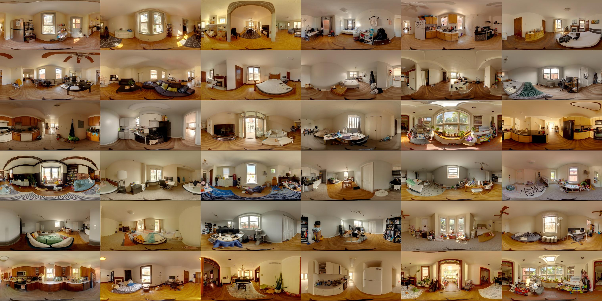
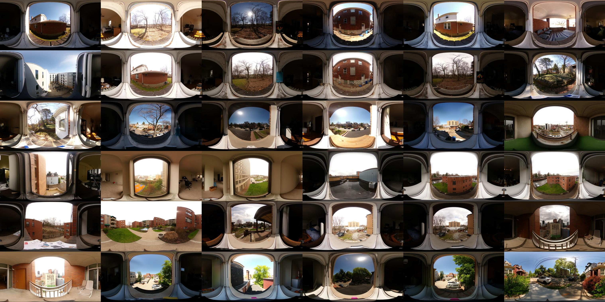

# pano2pano
calibrated HDR dataset for 141 paired indoor-outdoor panoramas

The complete dataset is available upon request. 
To access the download link, please email Guanzhou Ji (gji@andrew.cmu.edu). 

## Indoor Panorama


## Outdoor Fisheye


## Dataset Summary
[Click here to view the dataset summary](pano2pano_dataset.pdf)


## BibTeX
```
to be updated
```
